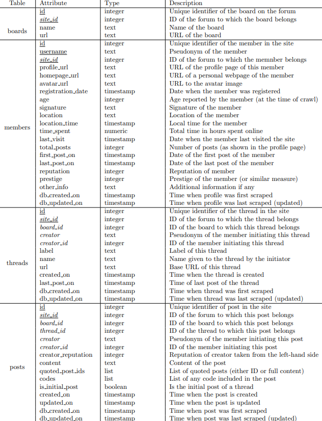
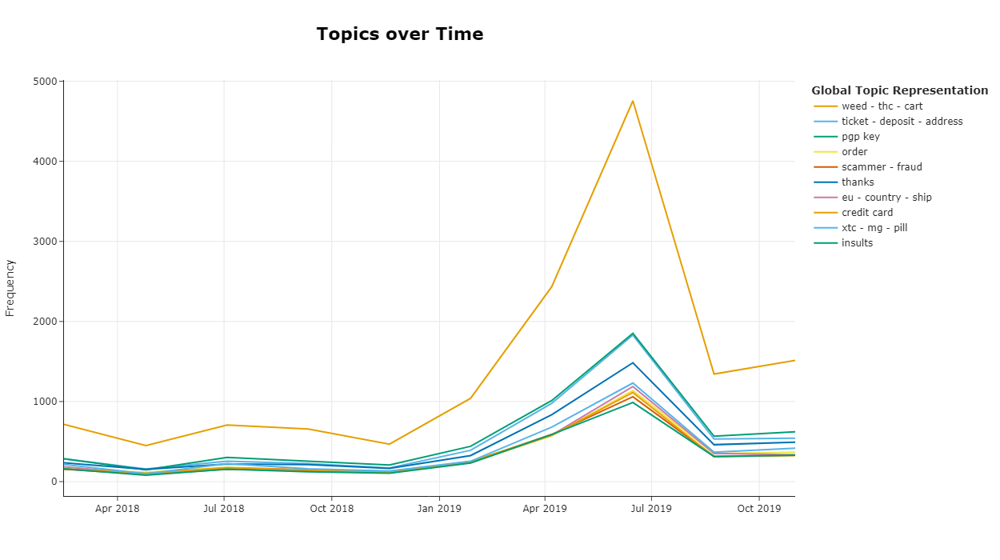
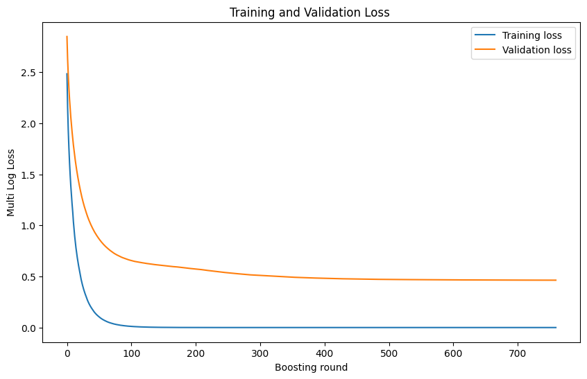
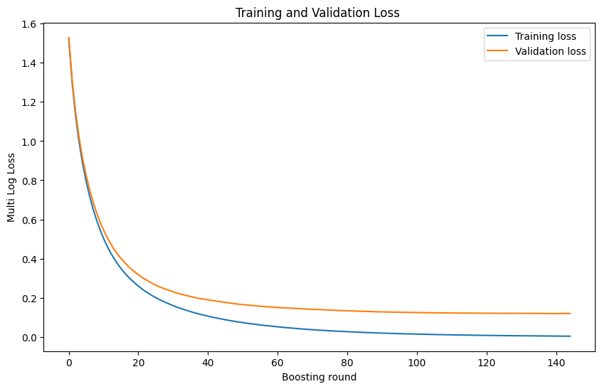
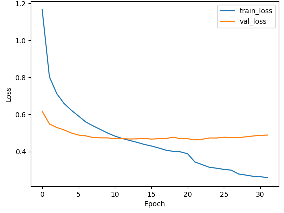
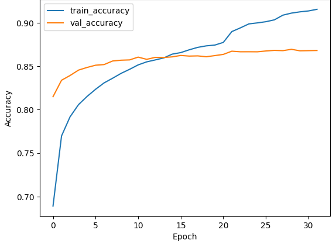

# Examination of the Evolution of Language Among Dark Web Users

## Table of Contents

- [Project Description](#project-description)
- [Utility of Dark Web Language Analysis](#utility-of-dark-web-language-analysis)
- [Repository Structure](#repository-structure)
- [Installation](#installation)
  - [Running on Google Colab](#running-on-google-colab)
- [Usage](#usage)
- [Datasets Used](#datasets-used)
- [Summary of Work Done](#summary-of-work-done)
- [Results](#results)
  - [Cluster Validation using LightGBM and LSTM](#cluster-validation-using-lightgbm-and-lstm)
- [Future work](#future-work)
- [Acknowledgements](#acknowledgements)
- [Citation](#citation)

## Project Description

The objective of this project was to analyze the evolution of language among Dark Web users using a series of Natural Language Processing (NLP) models. Several NLP models were developed and trained, including TF-IDF, LDA, BERT, and LSTM, to understand the context, sentiment, and thematic elements of forum discussions. After thorough analysis, the BERT model was chosen as the most effective.

For more details on the project, refer to the Medium article [here](https://medium.com/@domenicolacavalla8/examination-of-the-evolution-of-language-among-dark-web-users-67fd3397e0fb).

### Utility of Dark Web Language Analysis

This analysis is highly useful because it allows for the examination of large volumes of data to identify the main topics discussed, along with the nuances of associated words. Understanding these elements can provide insights into the nature of criminal activities, the evolution of their language, and the connections between various slang terms and specific illicit activities. This information can be invaluable for law enforcement, cybersecurity professionals, and researchers studying the dynamics of underground online communities.

However, only one forum has been analyzed so far. By combining multiple models with data from different forums over several years, a comprehensive picture of dark web language can be obtained. This is important because there may be other forums discussing topics not covered on Dread, such as red rooms, child pornography, hired killers, cannibalism, etc.

Unlike other approaches based on a few datasets, this method allows for the analysis of a vast number of conversations, greatly enhancing the breadth and depth of insights. In this way, a unique, highly comprehensive model could be developed (requiring multiple datasets), encompassing the most important topics discussed across various forums with a broader timeline. For example, insights could be drawn from forums like SilkRoad, which was very active and where certain words were used and then fell out of use.

Additionally, associating this data with images could lead to more precise identification. The current results are already highly valuable, demonstrating the potential of this approach.


## Repository Structure

The structure of the repository is as follows:

```
├───Analyze_files
│   ├───CombiningAnalysisCompleteDataset
│   │   ├───ContentAnalysis
│   │   │   ├───DatasetsContentBERTopic
│   │   │   ├───LLAMA
│   │   │   ├───ModelsContent
│   │   │   │   └───topic_model_all-MiniLM-L6-v2_190_20n_8dim_safetensors
│   │   │   ├───PreProcessFiles
│   │   │   └───ZeroShotClassificationResultsContent
│   │   │       └───all-MiniLM-L6-v2_190_20n_8dim
│   │   └───ThreadAnalysis
│   │       ├───DatasetsThreadBERTopic
│   │       ├───LLAMA
│   │       ├───Models
│   │       │   ├───topic_model_0.50Sil300_safetensors
│   │       │   ├───topic_model_0.64SilNew_safetensors
│   │       │   ├───topic_model_all-MiniLM-L6-v2_150_20n_safetensors
│   │       │   ├───topic_model_all-MiniLM-L6-v2_200_safetensors
│   │       │   └───topic_model_all-MiniLM-L6-v2_400_safetensors
│   │       ├───OtherFilesPreviousApproach
│   │       ├───ResultsCluster
│   │       ├───ResultsGridSearchBERTopic
│   │       └───ZeroShotClassificationResults
│   │           ├───all-MiniLM-L6-v2_150_20n
│   │           ├───all-MiniLM-L6-v2_200
│   │           ├───all-MiniLM-L6-v2_400
│   │           └───distiluse_7cluster
│   └───SingleDatasetsAnalysis
├───Datasets
│   ├───CleanedData
│   ├───FeatureEngineeringData
│   │   ├───Boards
│   │   ├───Members
│   │   └───Threads
│   ├───IntentCrime
│   └───RawData
├───Img
│   ├───Content
│   └───Thread
├───MergedModelBERT
├───MLModelsBERT
│   ├───Content
│   │   └───SavedModels
│   └───Thread
│       └───SavedModels
├───ShowModelsBaselineBERT
│   ├───Content
│   └───Thread
├───ShowResultsHTML
└───Util
```

The roles of the different folders are detailed below:

1. `Analyze_files`
Contains files and scripts for data analysis.

    1. `CombiningAnalysisCompleteDataset`
    Folder containing the analysis of tables (boards, threads, members, posts) merged into one

        1. `ContentAnalysis`
        Focuses on analysing the content of table posts using BERT models to extract topics.

            - `DatasetsContentBERTopic`: Contains datasets with the original content field with information extracted from BERT.
            - `ModelsContent`: Holds the specific BERTopic models for content analysis.
            - `PreProcessFiles`: Contains the pre-processing files of the content field.
            - `ZeroShotClassificationResultsContent`: Stores the results of the zero shot classification on custom topic names.
            - `LLAMA`: Stores the results of the use of LLAMA2 on custom topic names.

        2. `ThreadAnalysis`
        Focuses on analysing the content of table thread using BERT models to extract topics.

            - `DatasetsThreadBERTopic`: Same role as the content, focusing instead on the thread 
            - `OtherFilesPreviousApproach`: Contains files from previous approaches.
            - `ResultsCluster`: Dataset on cluster analysis of a previous approach.
            - `ResultsGridSearchBERTopic`: Contains the results of the grid search of BERTopic.
            - `ZeroShotClassificationResults`: Same role as the content, focusing instead on the thread.
            - `LLAMA`: Same role as the content, focusing instead on the thread.

    2. `SingleDatasetsAnalysis`
    Contains analyses for separate individual tables (boards, discussions, members, messages).

2. `Datasets`
Stores tables datasets used in the project.

    - `CleanedData`: Contains cleaned data ready for analysis.
    - `FeatureEngineeringData`: Contains data prepared for feature engineering.
    - `IntentCrime`: Specific dataset related to crime intent used for Zero-shot classification.
    - `RawData`: Contains raw, unprocessed data tables.

3. `Img`
    Stores images used for topic representation graphics found with BERTopic.

    - `Content`: Images related to content analysis.
    - `Thread`: Images related to thread analysis.

4. `MergedModelBERT`
Contains script merged BERT models.

5. `MLModelsBERT`
    Contains Machine Learning scripts and models used to validate datasets obtained from BERT approaches on content and threads including LightGBM and LSTM.

6. `ShowModelsBaselineBERT`
    Displays baseline BERT models.

    - `Content`: Content-related models.
    - `Thread`: Thread-related models.

7. `ShowResultsHTML`
Contains HTML files showing results of the analysis.

8. `Util`
Utility scripts and auxiliary functions used throughout the project to process data and evaluate models.<br>
**Note:** If using Google Colab and wanting to import these modules, see point 4 of this section: [Running on Google Colab](#running-on-google-colab)

## Installation

To install the project, follow these simple steps. **Note:** that this project uses Python `3.12.2`

1. Clone the repository:
    ```bash
    git clone https://github.com/humanai-foundation/humanai-foundation.github.io
    cd humanai-foundation.github.io/gsoc/2024/ISSR_Darkweb
    ```
2. Install the dependencies using `requirements.txt`:

    Using `venv` (Virtual Environment):
    ```bash
    # Ensure you are using Python 3.12
    python --version

    # Create and activate a virtual environment (optional but recommended)
    python3.12 -m venv myenv
    source myenv/bin/activate   # On Windows: myenv\Scripts\activate

    # Install the dependencies using requirements.txt
    pip install -r requirements.txt
    ```

    Using `conda`:
    ```bash
    # Ensure you are using Python 3.12
    python --version

    # Create and activate a conda environment (optional but recommended)
    conda create --name myenv python=3.12
    conda activate myenv

    # Install the dependencies using requirements.txt
    pip install -r requirements.txt
    ```
3. (Optional) Run the `download_files.py` script to download the additional files from Google Drive. This script handles retrieving files and placing them in the appropriate directories within the repository.<br>
Note: being quite heavy files (7 GB in total) choose carefully which models and files to download.
    ```bash
    python download_files.py
    ```

### Running on Google Colab

To run the notebooks on Google Colab, follow these steps:

1. Upload the repository to your Google Drive either manually or by cloning it from GitHub. <br>You can refer to this [guide](https://www.geeksforgeeks.org/how-to-clone-github-repository-and-push-changes-in-colaboratory/)

2. Mount your Google Drive in Colab:
    ```python
    from google.colab import drive
    drive.mount('/content/drive')
    ```
3. Change directory to the location of the current `.ipynb` file. <br>Replace `/content/drive/MyDrive/GSoC/Analyze_files/CombiningAnalysisCompleteDataset/ContentAnalysis/` with the actual path to your current `.ipynb` file:
    ```python
    import os
    os.chdir('/content/drive/MyDrive/GSoC/Analyze_files/CombiningAnalysisCompleteDataset/ContentAnalysis/')
    ```
4. To import the `.py` files present in the `Util` module, insert the directory containing the utility modules into the system path. <br>Replace `/content/drive/MyDrive/GSoC/Util/` with the actual path to your utilities directory:
    ```python
    import sys
    sys.path.insert(0, '/content/drive/MyDrive/GSoC/Util/')
    ```
    This way, you can import the `.py` modules present in the `Util` directory.
4. Install the necessary libraries. For example:
    ```python
    !pip install bertopic
    !pip install sentence_transformers
    ```
    
5. If you encounter the following error while performing DataFrame operations: `Index' object has no attribute '_format_flat'`, note that this is just a visualization issue. The cell will still execute successfully.

## Usage

Before executing the code, navigate to the directory where the saved BERTopic models are located:

```bash
cd Analyze_files/CombiningAnalysisCompleteDataset/ContentAnalysis
```

To perform topic prediction using the BERTopic model, follow these steps:

```python
import sys
sys.path.append('../../../Util')
import BERTopicUtils as btu
from bertopic import BERTopic

# Load the BERTopic model
topic_model = BERTopic.load("ModelsContent/topic_model_all-MiniLM-L6-v2_190_20n_8dim", embedding_model='all-MiniLM-L6-v2')

# Define a sentence for prediction
sentence = ['recently closed Samsara market']

# Perform topic prediction
btu.predict_topic(topic_model, sentence, custom_labels=True)
```

**Note:** we are using the `topic_model_all-MiniLM-L6-v2_190_20n_8dim`, which is not directly in the directory because it weighs 2.5GB but can be downloaded directly from the file `download_files.py`.
Alternatively, there is the version `topic_model_all-MiniLM-L6-v2_190_20n_8dim_safetensors` which is much smaller and is present in the directory, but the prediction results are much poorer. <br>
The BERTopic model used is one example, there are several. Just go to the ModelsContent subdirectory to see how many more there are.<br>
Or also use the templates in the thread section on Models:

```bash
cd ../ThreadAnalysis/Models
```

By default, the top 5 labels are set, but just set the `num_classes` parameter with the number of topics desired.

Clearly the custom `predict_topic` function is being used, alternatively, one could use BERTopic's `transform' function [directly](https://maartengr.github.io/BERTopic/getting_started/serialization/serialization.html), without importing anything else.

### Example Results
<div>
<table border="1" class="dataframe">
  <thead>
    <tr style="text-align: right;">
      <th></th>
      <th>Topic</th>
      <th>Probability</th>
      <th>Label</th>
      <th>Words</th>
      <th>Sentence</th>
    </tr>
  </thead>
  <tbody>
    <tr>
      <th>0</th>
      <td>[(samsara, 0.11383384349850058), (market, 0.01...</td>
      <td>1.0</td>
      <td>samsara market</td>
      <td>[samsara, market, samsara market, sam, dream, ...</td>
      <td>recently closed Samsara market</td>
    </tr>
    <tr>
      <th>1</th>
      <td>[(subdread, 0.047141772290036604), (sub, 0.018...</td>
      <td>0.0</td>
      <td>subdread - sub - post</td>
      <td>[subdread, sub, post, subdreads, create, dread...</td>
      <td>recently closed Samsara market</td>
    </tr>
    <tr>
      <th>2</th>
      <td>[(empire, 0.10987278200488068), (nightmare, 0....</td>
      <td>0.0</td>
      <td>empire - dread</td>
      <td>[empire, nightmare, empire empire, find empire...</td>
      <td>recently closed Samsara market</td>
    </tr>
    <tr>
      <th>3</th>
      <td>[(onion, 0.09360299836020991), (dot onion, 0.0...</td>
      <td>0.0</td>
      <td>onion link</td>
      <td>[onion, dot onion, dot, onion link, onion site...</td>
      <td>recently closed Samsara market</td>
    </tr>
    <tr>
      <th>4</th>
      <td>[(det, 0.04309335455807283), (er, 0.0412459466...</td>
      <td>0.0</td>
      <td>er - det - og</td>
      <td>[det, er, og, har, jeg, som, ikke, til, en, med]</td>
      <td>recently closed Samsara market</td>
    </tr>
  </tbody>
</table>
</div>

Note: In the same `.ipynb` file there are other examples

## Datasets Used

The CrimeBB dataset was used, specifically the "dread-2023-06-21" data scraped from Dread, updated on 2023-06-21 (for more details see the Citations section).<br> 
Dread is a popular forum on the Dark Web where users exchange opinions and reviews on various topics, including drug sales, seller reviews, password and bitcoin transactions, as well as passports and fake IDs.

For more details, here is a tables structure:



<br>The following tables were analyzed to extract the topics:
- **Post:** Contains 290k records.
- **Thread:** Contains 75k records.

## Summary of Work Done

The objective of this project was to analyze the evolution of language among Dark Web users using a series of Natural Language Processing (NLP) models. Initially, each table in the dataset was examined, reducing the number of features and eliminating outliers and duplicates. The focus was specifically on two tables: threads and posts, analyzing the fields `thread` and `content` respectively.

To gain an overview of the topics discussed, the `thread` field was analyzed first. Various approaches such as TF-IDF, LDA, and Zero-shot classification were used, and a class was developed that combined Sentence Transformer with t-SNE, PCA, and k-means. However, these methods did not yield optimal results.<br> Therefore, the BERTopic library was employed, which, thanks to its modularity, enabled the analysis of text by applying different strategies including Sentence BERT, c-TFIDF, KeyBERTInspired, introducing diversity with custom classes, and using UMAP for dimensionality reduction and HDBSCAN for clustering. Subsequently, Zero-shot classification was applied to the topic names.

This comprehensive approach resulted in two baselines:

- One with 7 macro clusters (general topics)
- Another with 68 clusters (aiming to identify as many relevant topics as possible while avoiding micro clusters)

These results were validated using metrics and distribution graphs provided by BERTopic, which also allowed for the analysis of topic distribution over time.

To further validate the results from an accuracy metrics perspective, a LightGBM model was trained using the embeddings as the input features (X) and the topics identified by BERTopic as the target variable. This was done to validate the BERTopic results in a classification task.

Subsequently, the `content` field in the posts was analyzed to verify if the topics identified matched those in the threads, which they did, resulting in 121 clusters.


## Results

These are the results of the cluster analysis produced by BERT on both threads and content.<br> For further graphical analysis (distance between clusters, hierarchy, distribution in space), please consult the html directory: `ShowResultsHTM`.

Thread:

| Metric                                  | Value (68 Topics) | Value (7 Topics) |
|-----------------------------------------|-------------------|------------------|
| Coherence Score                         | 0.57              | 0.40             |
| Silhouette Score                        | 0.50              | 0.51             |
| Davies Bouldin Score                    | 0.87              | 0.76             |
| Dos Score (Diversity Overlapped Score)  | 0.06              | 0.80             |
| Outliers                                | 0.30              | 0.42             |

Content:

| Metric                                  | Value (121 Topics)|
|-----------------------------------------|-------------------|
| Coherence Score                         | 0.69              |
| Silhouette Score                        | 0.60              |
| Davies Bouldin Score                    | 0.46              |
| Dos Score (Diversity Overlapped Score)  | 0.24              |
| Outliers                                | 0.35              |


There are many other graphs present representing topics and their distribution, for reasons of space only the `Content` graph of the top 10 most frequent topics distributed over time will be shown

<div style="text-align: center;">
  
</div>

### Cluster Validation using LightGBM and LSTM

These are the results obtained by LightGBM using the embedding and classes obtained by BERT for the thread field in a classification task:

Thread:

| Metric              | Value (68 Topics) | Value (7 Topics) |
|---------------------|-------------------|------------------|
| Accuracy            | 0.89              | 0.96             |
| Precision           | 0.91              | 0.96             |
| Recall              | 0.84              | 0.95             |
| F1 Score            | 0.87              | 0.96             |

<br>

|  |  |
|:------------------------------------------------------:|:---------------------------------------------------:|
| Loss Train Val 68 Topics                             | Loss Train Val 7 Topics                            |

<br>Instead, a neural network using two inputs was chosen for `Content`: a timestamp treated as LSTM and another input with embeddings obtained from BERT. In this way it is also possible to make predictions based on time and understand the evolution of the language.

Content:

| Metric              | Value (121 Topics)|
|---------------------|-------------------|
| Accuracy            | 0.87              |
| Precision           | 0.87              |
| Recall              | 0.86              |
| F1 Score            | 0.86              |

<br>

|  |  |
|:------------------------------------------------------:|:---------------------------------------------------------------:|
| Loss Train Val 121 Topics                             | Accuracy Train Val 121 Topics                                  |


## Future work

- [ ] **Merge Baselines**: The next steps involve merging the baselines obtained from the Thread and Content sections into a single model to integrate both representations, with Thread providing general topics and Content extending them.
- [X] **Validation**: Validate the results using clustering metrics and machine learning models. Given the data volume, LightGBM may not be sufficient, so exploring neural networks could be beneficial.
- [ ] **Topic Refinement**: Conduct a final review of the topics, potentially integrating specific expressions that need to be highlighted (e.g., a particular abbreviation for a drug that wasn't identified).
- [ ] **Integration with LLAMA2**: Incorporate LLAMA2 to better explain and refine the topic labels. LLAMA2 can provide more detailed and contextually relevant labels, enhancing the interpretability of the topics.
- [ ] **Deployment on HuggingFace**: Push both the "general" model with 7 topics and the more specific model resulting from merging the Thread and Content sub-models to HuggingFace.
- [ ] **Temporal Validation**: If time permits, validate the results over time using LSTM (currently done with BERT) to ensure temporal consistency and gain additional insights.
- [ ] **Multimodal Model**: Finally, consider making the model multimodal by incorporating both text and images. This would require more in-depth development.


## Acknowledgements

I would like to extend my heartfelt gratitude to my supervisors Jane Daquin, Andrea Underhill and the head of the organization Sergei Gleyzer for their unwavering support and guidance during the Google Summer of Code (GSoC) 2024 with HumanAI. Their mentorship provided me with the opportunity to fully express my creativity and push the boundaries of my capabilities.<br> This project was made possible thanks to the Google Summer of Code: [Google Summer of Code 2024](https://summerofcode.withgoogle.com/) and HumanAI: [HumanAI Foundation](https://humanai.foundation/).


## Citation

Dataset used CrimeBB: dread-2023-06-21

```
@inproceedings{10.1145/3178876.3186178,
    title = {CrimeBB: Enabling Cybercrime Research on Underground Forums at Scale},
    author = {Pastrana, Sergio and Thomas, Daniel R. and Hutchings, Alice and Clayton, Richard},
    year = {2018},
    isbn = {9781450356398},
    publisher = {International World Wide Web Conferences Steering Committee},
    address = {Republic and Canton of Geneva, CHE},
    url = {https://doi.org/10.1145/3178876.3186178},
    doi = {10.1145/3178876.3186178},
    booktitle = {Proceedings of the 2018 World Wide Web Conference},
    pages = {1845–1854},
    numpages = {10},
    location = {Lyon, France},
    series = {WWW '18}
}
```

BERTopic for experiments

```
@article{grootendorst2022bertopic,
  title={BERTopic: Neural topic modeling with a class-based TF-IDF procedure},
  author={Grootendorst, Maarten},
  journal={arXiv preprint arXiv:2203.05794},
  year={2022}
}
```